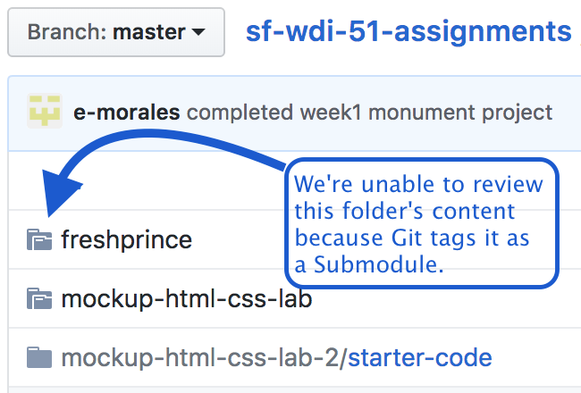
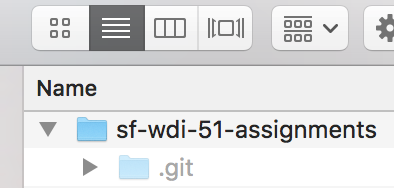

Web Development Immersive 51 Homework Repository
==========================================

Office hours with GA's mentors:    
Monday - Thursday 5-7pm, located in Concourse.

Sign up for [1 on 1 with instructional team][1o1].    
Reference [WDI-51 class resources][resources] for each assignment.

How To Use This Repo
--------------------

This is the repository where you'll submit your homework.    
Follow these directions closely to switch over to this repository.

### Setup (do this only once):
1. Fork this repository.
2. Clone your fork to your ```~/code``` folder.
3. Create a directory in the ```sf-wdi-51-assignments``` folder using your real name and github account name. Example: ```sf-wdi-51-homework/nicole-Borgaard```. That will make it easier for us to remember everyone's GitHub username. :)

### How to submit homework assignments:
1. Create a folder for the current week in your personal directory. 
2. Add each assignment in the current week's folder. Example for homework in week 2: `sf-wdi-51-assignments/nicole-Borgaard/week_2/slackBot/hubot.js`
3. `$ cd` to `sf-wdi-51-assignments`. To figure out where you are in terminal, `$ pwd` to find your present working directory.
4. `$ git add .` to stage files you'd like to commit and push to GitHub.
5. `$ git commit -m "adding week 2 slackBot assignment"` to add a descriptive comment about what you're doing. Comments are a requirement of the commit command.
6. `$ git push origin master` to push your local code to your personal remote repository on GitHub.
7. Your homework is now located on your personal repo (`yourUsername/sf-wdi-51-assignments`). Create a pull request to the homework repo (`Borgaard/sf-wdi-51-assignments`) to submit your assignment.


This is how your local directory should be structured:


    |-- wdi/
        |-- sandbox/ 
        |-- exercises/ 
        |-- lessons/ 
        |-- projects/ 
        |-- sf-wdi-51-assignments/ (cloned from Github)
            |-- firstName-githubUsername/
                |-- week_1/
                    |-- bottleApp/
                        |-- bottlesOfBeer.js
                        |-- index.html
                    |-- spontaneousTravelApp/
                        |-- randomAddressGenerator.js
                |-- week_2/
                    |-- hubot/
                        |-- hubot.js
                |-- week_3/
                |-- week_4/
                |-- week_5/

Weekly Homework
---------------

Homework [assigned each week][resources].
If any files are in the pull request outside of your personal folder, we will send it back to you to fix!

**Submit homework by pushing up to your `sf-wdi-51-assignments` fork, then submit a pull request**

Troubleshooting Git:
--------------------

### Submodules != folders
#### Submodule problem:
Submodules are Git's way of treating a project within a project as a separate entity. Explanation from [git-scm's][git-scm] documentation: 
> Submodules allow you to keep a Git repository as a subdirectory of another Git repository. This lets you clone another repository into your project and keep your commits separate.

...which is not a feature we want because _instructors are unable to access Submodule folders_, which prevents us from code reviewing your homework and giving you credit for your work.



When commits are made in `sf-wdi-51-assignments` (root directory) with a child `.git` folder nested within, a Submodule is created, so ensure you remove `.git` folders in projects you clone _before_ committing in root. 

#### Submodule Fix    
The student's local personal folder needs to be uncached, which will remove the Submodule.

1. Navigate to root homework directory `sf-wdi-51-assignments` in terminal.
2. Open Finder and use hotkey `cmd` `shift` `.` to view hidden files. You're looking to see that the hidden `.git` shows up in root. If you can see that hidden file, you can see hidden .git folders in child folders.
3. Open child folders to look for hidden .git folders; delete any you find that are not in root. 

PROTIP: use triangle view structure to reveal a folder's contents without entering it: 


4. In terminal from the root `sf-wdi-51-assignments` directory, add and commit your assignment folder's current state. Saving your state at this point is important; **do not skip this step**.
5. `$ git rm --cached -r YOUR_FOLDER_HERE`

Once you git add, commit, and push, your Submodule issue on Github will be resolved. Yay! :tada:

### Help! I can't push!
Read the error.    
What does it say? `$ git status` is your friend.

Here are some common issues:    
* Ensure you have added and committed your code from the root `sf-wdi-51-assignments` directory.    
* Where are you pushing? `git remote --verbose` to see your remote links and their nicknames. Are you pushing to `git push origin master`? Check the spelling.
* Is the error related to a hidden `.git` folder? Follow [steps 1-3](README.md#submodule-fix).


<!-- Links -->
[resources]: https://git.generalassemb.ly/sf-wdi-51
[1o1]: https://docs.google.com/spreadsheets/d/1IhDQLiCeZlOCLve4EEAzfwL1a22KipC6gaSTj_xQacc/edit#gid=0
[git-scm]: https://git-scm.com/book/en/v2/Git-Tools-Submodules
[submodule]: README.md#troubleshooting-git