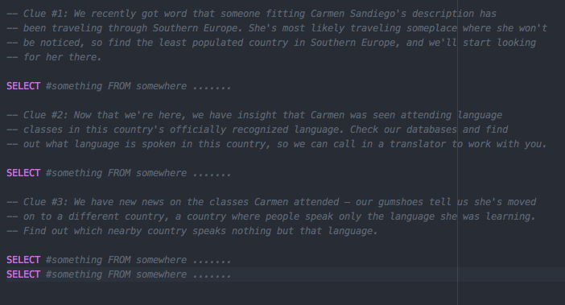

## Introduction

> ***Note:*** _This can be a pair programming activity or done independently._

#### Where In The World Is Carmen Sandiego?

We're going to use what we've learned already about searching with SQL commands, and apply it to chase down and capture an elusive and World-renowned thief, Carmen Sandiego. Follow the clues, use the interweb - write down both the SQL commands / queries you used and your answers to the clues - and figure out where Carmen's headed, so we can catch her and bring her in.

## Exercise

#### Requirements

- Fork and clone
- cd into the folder
- Use the clues.sql file as your "answer sheet"
- From the command line, let's create a new database called `world`.  
- `ctrl+d` to get out of postgres instance.
- Populate it with the SQL found in `world.sql` by running-

```sql
psql -U username -d world -a -f ./starter-code/world.sql
```

Start psql and connect to the new database called world:

```
psql -d world
```

Use the `\d` command to see what tables are available. You should see:

```
world=# \d
              List of relations
 Schema |      Name       | Type  |   Owner   
--------+-----------------+-------+-----------
 public | city            | table | moonmayor
 public | country         | table | moonmayor
 public | countrylanguage | table | moonmayor
```

You can write queries while you're in the `psql` command line interface. It's hard
to edit these commands in place. You can press CTRL+D to exit psql. CTRL+D only works
when you're on an empty line. If you're in the middle of entering text then press enter
to submit the current query (even if it has syntax errors) then press CTRL+D on an
empty line to quit.

Write your SQL commands into different .sql files and execute them using

```
psql -f query1.sql
psql -f query2.sql
psql -f query3.sql
... and so forth
```

Then, use the clues below to create the appropriate SQL queries to help you find Carmen and then, tell us where she's heading!!

### The Clues

  - **Clue #1:** We recently got word that someone fitting Carmen Sandiego's description has been traveling through Southern Europe. She's most likely traveling someplace where she won't be noticed, so find the least populated country in Southern Europe, and we'll start looking for her there.

  - **Clue #2:** Now that we're here, we have insight that Carmen was seen attending language classes in this country's officially recognized language. Check our databases and find out what language is spoken in this country, so we can call in a translator to work with you.

  - **Clue #3:** We have new news on the classes Carmen attended: our gumshoes tell us she's moved on to a different country, a country where people speak *only* the language she was learning. Find out which nearby country speaks nothing but that language.

  - **Clue #4:** We're booking the first flight out: maybe we've actually got a chance to catch her this time. There are only two cities she could be flying to in the country. One is named the *same* as the country – that would be too obvious. We're following our gut on this one; find out what other city in that country she might be flying to.

  - **Clue #5:** Oh no, she pulled a switch: there are two cities with very similar names, but in totally different parts of the globe! She's headed to South America as we speak; go find a city whose name is *like* the one we were headed to, but doesn't end the same. Find out the city, and do another search for what country it's in. Hurry!

  - **Clue #6:** We're close! Our South American agent says she just got a taxi at the airport, and is headed towards the capital! Look up the country's capital, and get there pronto! Send us the name of where you're headed and we'll follow right behind you!

  - **Clue #7:** She knows we're on to her: her taxi dropped her off at the international airport, and she beat us to the boarding gates. We have one chance to catch her, we just have to know where she's heading and beat her to the landing dock.

  - **Clue #8** Lucky for us, she's getting cocky. She left us a note, and I'm sure she thinks she's very clever, but if we can crack it, we can finally put her where she belongs – behind bars.

```
  Our play date of late has been unusually fun –
  As an agent, I'll say, you've been a joy to outrun.
  And while the food here is great, and the people – so nice!
  I need a little more sunshine with my slice of life.
  So I'm off to add one to the population I find
  In a city of ninety-one thousand and now, eighty five.
```


#### Starter code

Again, be sure to run the .sql file from the [starter-code](starter-code/world.sql) using the commands above.

#### Deliverable

Use the clues.sql file to write in the SQL queries that correspond with each clue and tell us where she's heading at the bottom:

<p align="center">
  
</p>

Be sure to submit a pull request with your SQL queries and add a comment that includes your answer to where Carmen is!

## Licensing
All content is licensed under a CC­BY­NC­SA 4.0 license.
All software code is licensed under GNU GPLv3. For commercial use or alternative licensing, please contact legal@ga.co.

