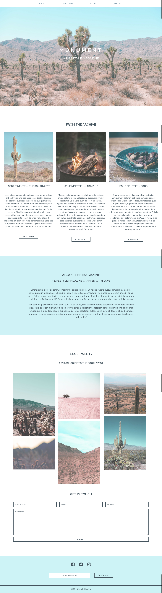

#  Monument Landing Page

## Exercise
Your designer has completed the mockups for the landing page of Monument Lifestyle Magazine. Use HTML and CSS to replicate this mockup as closely as possible.

#### Requirements

- Add media queries to make the site responsive, updating padding, margins, fonts, and layout as needed. 
- Use rems or ems for padding, margin, and font sizes.
- Links and buttons should include hover effects with a CSS transition to make them run smoothly.
- Use anchor tags to link together the landing page and the blog page you created this week.
- Use the appropriate Google Fonts to style the text on the page. The site should use [Lato](https://fonts.google.com/specimen/Lato) for paragraph text and [Raleway](https://fonts.google.com/specimen/Raleway) for all other text.
- Code should follow best practices, including proper indentation and valid syntax.
- Use [HTML](https://html5.validator.nu/) and [CSS](https://jigsaw.w3.org/css-validator/#validate_by_input) validators to check for errors before submitting.
- Include [browser prefixes](http://pleeease.io/play/) to make sure that newer CSS properties render consistently in different browsers.

#### Bonus
- Google and implement "jump links" to scroll to the appropriate page and section whenever the user clicks on a link in the main navigation.
- Add a hover effect for images in the gallery.
- Google and implement a "fixed" effect for the 'background-image` in the header (see .gif under 'Deliverable' for an example).
- Create wireframes for a store page and implement your design.

#### Starter Code

You will continue working on the project you've built out this week. All images needed for the landing page should be included in the images folder.

#### Deliverable

Refer to these design mockups when building the landing page. Pay close attention to detail!

##### Mockups for bonus tasks:

### Useful Resources

- [Getting Started with FontAwesome Icons](http://fontawesome.io/get-started/)
- [HTML5 Validator](https://html5.validator.nu/)
- [CSS Validator](https://jigsaw.w3.org/css-validator/#validate_by_input)
- [HTML5 Tag Reference](http://www.htmldog.com/references/html/tags/)
- [HTML5 Element Flowchart](http://html5doctor.com/downloads/h5d-sectioning-flowchart.pdf)
- [CSS Property Reference](https://developer.mozilla.org/en-US/docs/Web/CSS/Reference)
- [Video — Box Model](https://www.youtube.com/watch?v=HNgdhp1_kEE&list=PLdnONIhPScST0Vy4LrIZiYKpFNoxgyH7J&index=6)
- [Video — Display](https://www.youtube.com/watch?v=qjSe_K3agYc&list=PLdnONIhPScST0Vy4LrIZiYKpFNoxgyH7J&index=7)
- [Video — Flexbox Intro](https://www.youtube.com/watch?v=tqdqEiTlqF0&list=PLdnONIhPScST0Vy4LrIZiYKpFNoxgyH7J&index=33)
- [Video — Flexbox, Pt. 2](https://www.youtube.com/watch?v=7d8aAw8mzjI&index=34&list=PLdnONIhPScST0Vy4LrIZiYKpFNoxgyH7J)
- [Video — Flexbox Child Properties](https://www.youtube.com/watch?v=zDYAbI78dzc&list=PLdnONIhPScST0Vy4LrIZiYKpFNoxgyH7J&index=35)
- [Video — Responsive Design](https://www.youtube.com/watch?v=BsuCBmzLf_U&list=PLdnONIhPScST0Vy4LrIZiYKpFNoxgyH7J&index=21)
- [Video — Media Queries](https://www.youtube.com/watch?v=GYygtVolViM&list=PLdnONIhPScST0Vy4LrIZiYKpFNoxgyH7J&index=23)
- [Video — Forms](https://www.youtube.com/watch?v=-5tH2qnTnH0&index=16&list=PLdnONIhPScST0Vy4LrIZiYKpFNoxgyH7J)
