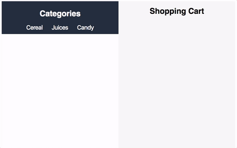

#  Supermarket Website

## Exercise
In our last project, we worked on creating a static landing page. In this project, we will create an interactive ecommerce website for our local supermarket.

##### Requirements
* Use semantic HTML and CSS to create your website. Use your creativity to design and develop your vision for this website.
* There should be at least three buttons on your website, which represent different categories of items you can buy at the supermarket (for example, a button for cereal, meats, juices).
* When a category is clicked, your page should populate with at least five images of items related to that category (for example, clicking on the cereal button will show five different types of cereal).
* When I click on a specific shopping item, the item should be added to my shopping cart. The shopping list will show all of the items that the user has currently selected.
* Keep your code DRY.

> Take a look at the following screenshot for an example of what your project should do. Add your own design and styling to it, and make it your own!

#### Hints
* Having trouble attaching event handlers to your shopping list items? When we add event listeners to our DOM objects, they are only added to elements that exist on the page at the point of time that the code runs. How would we add event listeners to elements that are created dynamically? Look at event delegation.

#### Bonus
* Add a button to delete items from our shopping list.
* Include prices for each shopping item, and update the shopping cart with your grand total. Google the `data` attribute and see how you can take advantage of that to include data related to your HTML.
* Use jQuery to add beautiful effects and animations to your user interactions.
* So far, our programs have reset their variables as soon as the page is refreshed, so we don't have any data that persists. Modern browsers provide us with `localStorage`, a lightweight option for us to save information in the browser that persists through page refreshes. Implement `localStorage` to save our shopping list.

### Resources
* [MDN Introduction to Events](https://developer.mozilla.org/en-US/docs/Learn/JavaScript/Building_blocks/Events)
* [MDN Reference for LocalStorage](https://developer.mozilla.org/en-US/docs/Web/API/Window/localStorage)
* [A Complete Guide to Flexbox](https://css-tricks.com/snippets/css/a-guide-to-flexbox/)
