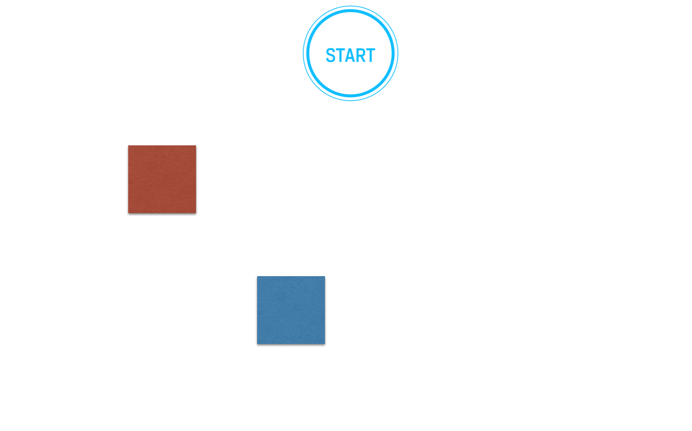
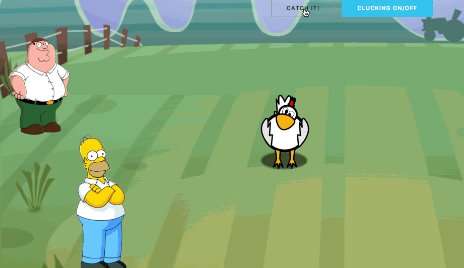
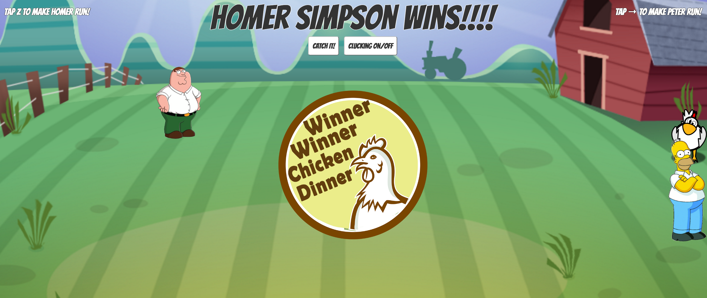

# JavaScript Racer

## Introduction

We are going to create a "racer game" using JavaScript, HTML, and CSS. This will be your first "formal" challenge to assess your knowledge of programming fundamentals and HTML/CSS.

You will work individually on this assignment, but we will guide you as you get started.


## Exercise

#### Requirements

- You should use separation of logic. In other words, include separate HTML, CSS, and JavaScript files.
- Choose an existing landing page on the web; screenshot the landing page, and replicate its markup to create a separate landing page that links to your actual game.

  For example, in this landing page, when you click on the "Explore" button, you would be redirected to the game:


- Build out your game page; your game should only start on the click of a button. The button can say anything you would like; for example, "START" or "CATCH IT." Here is an example of a racing game:




Here is a more complicated example:



- Style your landing page and game page with class-based CSS. For example:

```css
.btn-success {
  background: #18BC9C;
  border-color: #18BC9C;
}

```

- Include a media query for a tablet to make your pages responsive.

  For example:

```css
@media (min-width: 768px) {
  header .container {
    padding-top: 200px;
    padding-bottom: 100px;
  }
  header .intro-text .name {
    font-size: 4.75em;
  }
  header .intro-text .skills {
    font-size: 1.75em;
  }
}

```

- Use flexbox to build a grid system. For example:


```css
.Grid {
  display: flex;
}

.Grid-cell {
  flex: 1;
}

```

- Comment your code appropriately. For example:

```js
//this detects how much distance the user has scrolled from the top

```

- Adhere to the [AirBnB style guide](https://github.com/airbnb/javascript) for writing your JavaScript
- Adhere to the [Google style guide](https://google.github.io/styleguide/htmlcssguide.xml) for writing your HTML/CSS

**Bonus:**

- Use images to create a background and/or players.
- Score each game based on the time it took to complete, and by how much time the player beat the opposition.
- Display the time it took for the player to complete the race.
- Make a 'Best of 3' tournament and display the winner of the tournament.
- Keep track of best times/high scores across page refreshes using `localStorage`.
- Add animations.
- Have players do something other than simply pressing a key to move their player; for example, make them type words, or solve simple math problems.
- Upon the click of a button, allow your players to turn a sound on or off.

#### Starter code

There is no starter code for this project other than blank HTML, CSS, and JS files located in the code folder of this repo. Here are some tips on how to get started:

- Start simple! Ask yourself what the MVP of this project is.
- Create HTML and CSS files that create one red square div and one blue, lined up on the left side of the screen.
- Add a keydown event listener that console logs "blue move" or "red move."
- Replace that console log with JavaScript that moves the red or blue div a little to the right.
- A helpful jQuery method to look into: [offset()](http://api.jquery.com/offset/).
- Run with it from there!
- If you are stuck on a problem, use pseudocode to break it down into smaller, more solvable problems.
- If you need some ideas on where to start, watch this [video](https://www.youtube.com/watch?v=QVSwX98kKFs).

#### Deliverable

You should turn in your HTML, CSS, and JavaScript files to a GitHub repository (fork or separate repo). In your readme file, include a screenshot of the webpage you've used to build your landing page.

Here's a screenshot of what your game page could look like:



## Additional Resources
- JavaScript [Documentation](https://developer.mozilla.org/en-US/docs/Web/JavaScript).
- An [excellent resource](https://developer.mozilla.org/en-US/docs/Web/Events) for working with the DOM in Vanilla JavaScript.
- [Should you learn DOM manipulation in JavaScript before jQuery?](https://www.reddit.com/r/javascript/comments/3hpm1v/should_i_learn_dom_manipulation_with_raw/)
