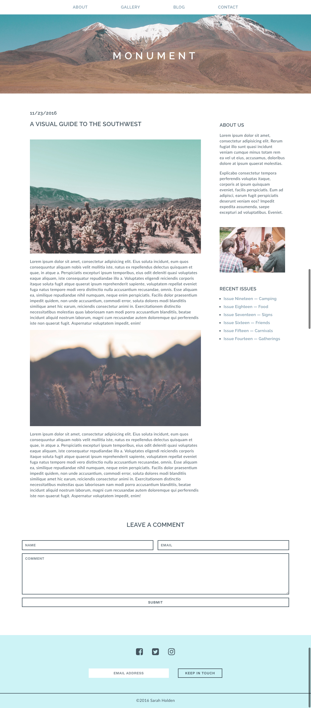

#  Monument Landing Page, Part 3

## Exercise

Congratulations! You're almost done with the blog page for Monument Lifestyle Magazine. Today you will continue to build up the site by adding a comment form and making the site responsive. Are you ready?

#### Requirements

- Add the HTML/CSS to create the contact form shown in the design mockup.
- Add a media query to update the layout and styles for screens sized 560px and below.
- Convert padding, margin, and font sizes from px to rem/em, making sure fonts, padding, and margins scale accordingly.
- For the articles, change the two-column layout to a single-column layout where appropriate.
- Form inputs should include the appropriate `type` attribute, along with a `name` attribute.
- All input/text-area elements should be wrapped in a `form` element.
- Use the appropriate Google Fonts to style the text on the page.
- Use [HTML](https://html5.validator.nu/) and [CSS](https://jigsaw.w3.org/css-validator/#validate_by_input) validators to check for errors before submitting.
- Include [browser prefixes](http://pleeease.io/play/) to make sure that newer CSS properties render consistently in different browsers.

#### Bonus
- Evaluate the page in your browser and consider what layout/style updates could be made for medium-sized screens (i.e., tablets; around 775px and below).
- Implement these updates by incorporating an additional media query (or queries).
- Look up the transition property and add transitions to any elements that have a hover effect.

#### Starter Code

You will continue working on your project from the last two days.

#### Deliverable

Larger screens:

Mobile screens:

### Useful Resources

- [Getting Started with FontAwesome Icons](http://fontawesome.io/get-started/)
- [HTML5 Validator](https://html5.validator.nu/)
- [CSS Validator](https://jigsaw.w3.org/css-validator/#validate_by_input)
- [HTML5 Tag Reference](http://www.htmldog.com/references/html/tags/)
- [HTML5 Element Flowchart](http://html5doctor.com/downloads/h5d-sectioning-flowchart.pdf)
- [CSS Property Reference](https://developer.mozilla.org/en-US/docs/Web/CSS/Reference)
- [Video — Responsive Design](https://www.youtube.com/watch?v=BsuCBmzLf_U&list=PLdnONIhPScST0Vy4LrIZiYKpFNoxgyH7J&index=21)
- [Video — Media Queries](https://www.youtube.com/watch?v=GYygtVolViM&list=PLdnONIhPScST0Vy4LrIZiYKpFNoxgyH7J&index=23)
- [Video — Forms](https://www.youtube.com/watch?v=-5tH2qnTnH0&index=16&list=PLdnONIhPScST0Vy4LrIZiYKpFNoxgyH7J)
