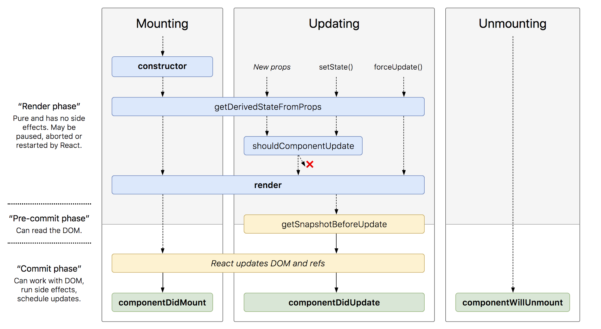

# Event Handlers and the Component Lifecycle in React

## Learning Objectives
* Understand how to use React's lifecycle methods
* Retrieve data from an API inside of a component
* Handle events in React
* Look at the React documentation to learn more

## Framing (10 min / 0:10)

So far, we've used react components to build simple applications. We've added state and props and controlled data flow through them (using just the render and setState methods). In order to do more complex things, we'll have to use lifecycle methods.

How do we get data from an API? Well we could drop in an AJAX call to fetch some data, but our component would likely render before the AJAX request finished. Our component would see that our data is `undefined` and either render a blank/empty component or throw an error.

How would we animate a component? (i.e. a sidebar that usually lives off the page, except for when a hamburger menu is pressed.) We could write some code to animate the position of the sidebar, but how could we guarantee it was running after our Sidebar component's render method had been called?

This lesson will walk us through the Component Lifecycle: hooks that are fired at different stages of a components "life" for solving the problems described above, as well as many others.

Throughout the course of this lesson, we'll build out a simple flashcard app with vocabulary keywords pulled from the Oxford Dictionary API. Our flashcard app will cycle through a set of flashcards, giving us 10 seconds to think of the definition before moving on to the next card.

But first, what is the Component Lifecycle?

## The Component Lifecycle (10 min / 0:20)

Components provide several lifecycle methods that you can use to control your application based on the state of the UI.

When you include these methods in the component they will be invoked automatically (because we are extending the React.Component class which has them already defined).

Lifecycle methods are called at specific points in the rendering process. You can use these methods to perform actions based on what's happening on the DOM.

* `componentWillUnmount` is called immediately *before* a component is removed from the DOM.
* `componentDidMount`, for example, is called immediately *after* a component is rendered to the DOM.

**What do you use lifecycle methods for?**

Making asynchronous requests (ajax calls), binding event listeners to components, animating components (once they've rendered), and optimizing for performance (shouldComponentUpdate).

**Why is it called a lifecycle?**
It's an action that repeats in a specific order.



### At a very high level

There are two types of component lifecycle methods:

* **Mounting** lifecycle methods. e.g. What happens when the component is created? Was an initial state set? Methods:
  - `constructor(props)`
  - `UNSAFE_componentWillMount()`
  - `static getDerivedStateFromProps(props, state)`
  - `render()`
  - `componentDidMount()`

* **Updating** lifecycle methods. e.g. Has state changed? Methods:
  - `UNSAFE_componentWillReceiveProps()`
  - `shouldComponentUpdate(nextProps, nextState)`
  - `UNSAFE_componentWillUpdate()`
  - `render()`
  - `getSnapshotBeforeUpdate(prevProps, prevState)`
  - `componentDidUpdate(prevProps, prevState, snapshot)`
 
* **Unmounting** lifecycle method when the component is removed from DOM
  - `componentWillUnmount()`
	
The documentation gives good examples of what each method should be used for. [Check out the documentation on components!](https://facebook.github.io/react/docs/react-component.html)

## We do: Exploring the Lifecycle methods (20 min / 0:40)

Let's clone down [this repository](https://git.generalassemb.ly/SF-WDI/react-component-lifecycle/tree/master/react-component-lifecycle) with a short exercise for exploring the lifecycle methods.

This exercise is a simple, 2 "page" website where each page is a component. We'll be adding the component lifecycle methods to each page-component. As we do consider the following questions:

* What order are the methods run in? Before or after rendering?
* How many times is the method invoked?
* What causes the method to be (re)invoked?

> Add the mounting methods to HomePage.js and the update methods to AboutPage.js. console.log something in each method to understand the order.

### An Aside: Axios (10 min / 0:50)

For our first example of working with the component lifecycle methods, we'll be retrieving data from an API using AJAX.
AJAX calls are asynchronous, so we have to be mindful of how long our request will take and when our components will render.

We're going to use a module named `axios` to make our calls. Axios is a node module commonly used with React to send HTTP requests to an API. It functions much like jQuery's Ajax method, or window.Fetch(). Some benefits to using Axios:

* It is a promise-based library with an interface for simpler and cleaner syntax (compared to native XHR especially).
* It is lightweight and focused solely on handling HTTP requests (as opposed to jQuery which brings in an extensive set of new functions and methods)
* It is very configurable and has a number of useful methods for doing more complex requests from one or multiple API endpoints
* It handles a lot of the http header manual work for you (e.g. send a json file, it sets `Content-Type: application/json`)

Read more at the [Axios Documentation](https://github.com/mzabriskie/axios)

> Note: Axios is just one of many Javascript libraries that we could use for handling requests. One of the big selling points of javascript is the ability to mix and match technologies according to preference. Other commonly-used tools for handling requests are fetch and jQuery.

To load in the Axios module:

```js
// If you are using Babel to compile your code
import axios from 'axios'

// In standard vanilla Javascript
let axios = require('axios')
```

To use Axios to query an API at a given url endpoint:

```js
axios.get('url')
  .then((response) => {
    console.log(response)
  })
  .catch((error) => {
    console.log(error)
  })
```

<!-- You can also append values to the parameters by passing in a second input to `.get()`:

```js
  axios.get('url', {
    params: {
      key1: value1,
      key2: value2
    }
  })
  .then((response) => {
    console.log(response)
  })
  .catch((error) => {
    console.log(error)
  })
```

Which would result in a GET request to: `url?key1=value1&key2=value2`.
 -->

<!-- ### We Do: Axios and AJAX inside a React Component:
> 15 min / 1:05

We will be using Axios to query the PokéAPI in [this exercise](https://git.generalassemb.ly/ga-wdi-exercises/react-components-axios). -->

## Flashcards (90 min / 2:30)

As we dive deeper in to each of the component lifecycle methods and what they're used for, we'll work through the following exercise to create a simple flashcards app.

The starter code for this exercise can be found [here](https://git.generalassemb.ly/SF-WDI/flashcards).

Let's go ahead and clone the repository:

```bash
$ git clone https://git.generalassemb.ly/SF-WDI/flashcards
$ npm install
$ npm start
```

The app we're going to build will pull characters from a dictionary API and create a flashcard for each word and definition`. The app will then cycle through each word, giving the user 10 seconds to think of the definition before moving on to the next card. 

The solution code is [here](https://git.generalassemb.ly/SF-WDI/flashcards/tree/solution)

### We Do: Adding the Flashcard Container

#### Use Axios to query the dictionary API

<details>
    <summary>Solution</summary>

```js
// FlashcardContainer.js

class FlashcardContainer extends Component {
  constructor() {
    super(); 

    this.state = {
      flashcards: [],
      currentIndex: 0
    }
  }

  componentDidMount() {
    axios.get(CLIENT_URL)
      .then((response) => {
          console.log(response)
          this.setState({flashcards: response.data})
        })
  }

  render() {
    let detail = this.state.flashcards[this.state.currentIndex]
    let card;

    if(detail) {
      card = <Flashcard detail={detail}/>
    }

    return (
      <div>
        {card}
      </div>
    )
  }
}
```

</details>

The componentDidMount method is called once, immediately after your component is rendered to the DOM. If you want to make an AJAX request when your component first renders, this is where to do it (not in the constructor, or in componentWillMount). componentWillMount shouldn't be used for server requests because it may be invoked multiple times before render. Side effects should be avoided in the constructor, and so server requests shouldn't be made there.

#### Add an event listener to switch between cards

<details>
    <summary>Solution</summary>

```js
//FlashcardContainer.js

class FlashcardContainer extends Component {
  state = {
      flashcards: [],
      currentIndex: 0
    }

  // increment currentIndex
  next () {
    let nextIndex = (this.state.currentIndex + 1) === this.state.flashcards.length
      ? this.state.currentIndex
      : this.state.currentIndex + 1

    this.setState({currentIndex: nextIndex})
  }

  // decremement currentIndex
  prev () {
    let prevIndex = (this.state.currentIndex - 1) < 0
      ? 0
      : (this.state.currentIndex - 1)

    this.setState({currentIndex: prevIndex})
  }

  // callback to be used in the event listener below
  handleKeyUp (event) {
    if (event.keyCode === 39) this.next()
    if (event.keyCode === 37) this.prev()
  }

  componentDidMount () {
    window.addEventListener('keyup', this.handleKeyUp)

    axios
      .get(CLIENT_URL)
      .then(response => this.setState({flashcards: response.data}))
      .catch(err => console.log(err))
  }

  render() {
    let detail = this.state.flashcards[this.state.currentIndex]
    let card;

    if(detail) {
      card = <Flashcard detail={detail}/>
    }

    return (
      <div>
        {card}
      </div>
    )
  }
}
```

</details>

In this example, we have added a constructor that has a few initial state properties. We also add an event listener that switches to the next card on right arrow press. Finally, we add an API pull to fetch the dynamic data we will use for the app.

### You Do: Adding a Timer to the Flashcard

Add a timer to the Flashcard Detail component.

* Initialize the timer to have 10 seconds on it
* Every second the same flashcard is still on the board, remove a second from it
> **hint**: use `setInterval()`)
* When the timer reaches zero, switch to the next card
> **hint**: where did you define the `next()` method? How can you access it from `Flashcard.js`?
* When the `Flashcard` component receives a new card, restart the timer


#### We Do: Adding the Definition Component

Now that we have our flashcard displayed, lets add their definitions as well.

For this, we will use a pure functional component -- or a component created by a function instead of a class -- and then change its style dynamically based on its index.

<details>
    <summary>Solution</summary>

```js
//Definition.js

import React from 'react';

let Definition = (props) => {

	return (
		<div className="">
			<p>{props.def}</p>
		</div>
	)
}

export default Definition;
```

```js
// Flashcard.js
...
class Flashcard extends Component {
  render() {
    let defs = this.props.detail.definitions[0].definitions 

    return (
      <div class="card">
        <p>{this.props.detail.word}</p>
        { defs.map(def => <Definition def={def} /> )}
      </div>
    )
  }
}
...
```

</details>

## You Do: Show or Hide the Definition

Add a button that, when clicked, toggles whether or not the definition card is displayed on the page.

## React Documentation

* What is an uncontrolled component in React? Why would we use it instead of a controlled one?
* Describe 1-way and 2-way data binding. Which model does React use? Explain and compare to other popular front-end frameworks.
* Describe how to best gather information from a form in React. Be prepared to show code!
* Compare and contrast stateful, stateless, and functional components in React. List the pros and cons of each. When would we use one over the other?

## Bonus


## Event Handlers

Throughout the last few classes, you've seen a couple event handlers. These look similar to including them inline in HTML.

In the React Intro class, we went over how we are not actually interacting directly with the DOM when we write React code, rather, we are interacting with the virtualDOM. Because of this, when we call an event listener, we use `SyntheticEvent`'s instead of the usual event objects we are used to dealing with in JQuery events. We still get all of the same properties attached to them, and some additional ones. Because of this, the traditional documentation on event handlers is sometimes not accurate. Instead, use the React event handling documentation found [here](https://facebook.github.io/react/docs/events.html). Spend a few minutes looking at the different events on listed here.
