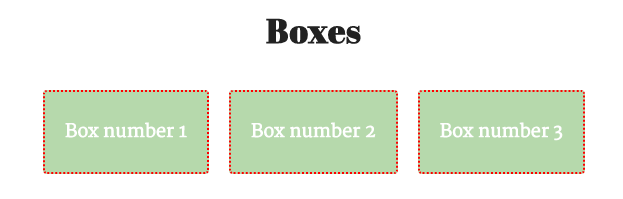
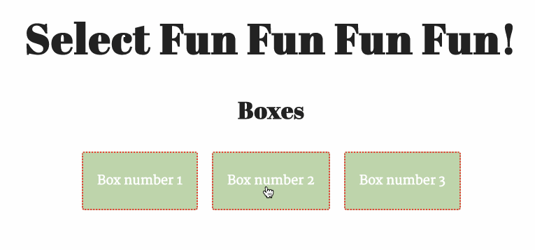
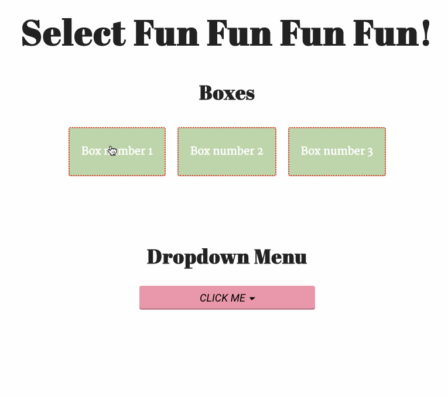
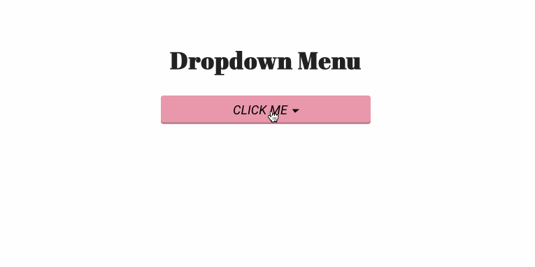
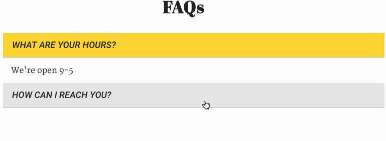
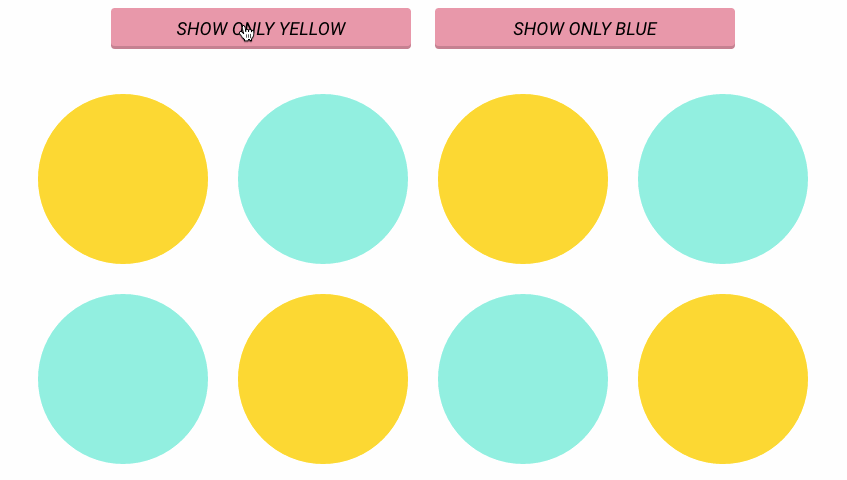

#  jQuery Selector Lab

## Learning Objectives

- Practice using jQuery selectors.
- Use and implement popular jQuery methods: `.hide()`, `.show()`, `.data()`, `.hasClass()`, `.addClass()`, `.removeClass()`, `.attr()`.
- Apply jQuery to manipulate, add, and remove DOM elements & element styles.
- Dynamically apply and remove CSS classes using jQuery.
- Add event listeners.

## Introduction

> ***Note:*** _This can be a pair programming activity or done independently._

This lab is broken into two parts.

In the first part of this lab session, you'll practice building out some simple interactions and using jQuery selectors.

In the second part of this lab session, you'll work on building out an interactive nav.

## Exercise 1 - Select Fun 

#### Requirements

##### Part 1
1. Go to `style.css` and find the `fun` class (at the end of the document).
      - Style that class with your choice of background-color and text color.

2. Using jQuery, add the `fun` class to the elements with the class `.box`.

3. When `#box2` is clicked on:

	a) Remove the `crazy` class from all the items with a class of `.box`.
	
	b) Add the `crazy` class to the `h1`.
	
	c) Slide toggle `#box3`.

4. When any `.box` is clicked, change the text in the `header`'s `h1` tag to read "jQuery Ninja".

5. When `#box1` is clicked on:

	a) Run the following line of code: `$(".moto").attr("src", "images/moto.jpg")`;
	
	b) Write a JavaScript comment with a description of what happened (to get practice writing a comment).

##### Part 2 - Dropdown Menu
6. Hide the item with the id `#menu`.

7. When the element with the id `#trigger` is clicked:
	a) slide toggle `#menu`.

##### Part 3 - FAQ Section
8. Hide the item with the id `#answer2`.

9. Show the item with the id `#answer1`.

10. When `#question2` is clicked:

	a) Slide down `#answer2`.
	
	b) Slide up `#answer1`.
	
	c) Remove the `active` class from all list items.
	
	d) Add the `active` class to `#question2`.

11. When `#question1` is clicked:

	a) Slide down `#answer1`.
	
	b) Slide up `#answer2`.
	
	c) Remove the `active` class from all list items.
	
	d) Add the `active` class to `#question1`.

##### Part 4 - Filter

For this last one, the steps aren't broken down for you line-by-line. See if you can figure these out!

12. When the `button` "Show Only Yellow" is clicked, only show circles with the class `.yellow`.

13. When the `button` "Show Only Blue" is clicked, only show circles with the class `.blue`.

#### Starter code

HTML, CSS, and JS files have been provided in the [starter\_code/select\_fun](starter_code/select_fun) folder. The above instructions are also listed in the main.js file.

#### Deliverable

Here's what each step will look like when you're finished:

##### Steps 1 and 2:

##### Steps 3 and 4:

##### Step 5:

##### Steps 6-7:

##### Steps 8 - 11:

##### Steps 12 - 13:

## Hungry for More?
- If you finish early, follow the instructions in [starter\_code/select\_fun\_part\_2/js/main.js](starter_code/select_fun_part_2/js/main.js).

## Exercise #2 - Interactive Nav 

In this portion of the lab session, you'll build out an interactive nav.

Before we get started, let's spend a few minutes looking up data-attributes in order to practice Googling and looking things up in the jQuery documentation.

- With a partner, spend 10 minutes researching how to use data attributes with jQuery.
  - Bonus: Come up with an example.
  - Bonus: Why are data attributes useful?
- Regroup as a class and share research on data attributes.
  - What resources did you find most helpful when looking this up?

#### Requirements
- Spend 5 minutes writing out pseudocode with a partner.
- When the user clicks on an anchor in the main nav:
  - If the subnav is hidden, slide down the subnav and fade in the related panel showing options for that category.
  - If the subnav is already showing and the user clicks on a different anchor than they had previously clicked on, hide the current panel and fade in the related panel with subnav options for that category.
  - If the subnav is showing and the user clicks on the category that is already showing, slide up the subnav.

#### Hints
- You'll want to use the `this` keyword to find out which panel the user clicked on.
- Each anchor in the main nav has a data attribute that can be used to figure out the related panel that should be displayed (`data-related-panel`).
- Each related panel has an `id` attribute that matches the `data-related-panel` attribute on the corresponding nav anchor.

#### Starter Code

HTML, CSS, and a JS file have been provided for you in [starter\_code/interactive\_nav](starter_code/interactive_nav).

#### Deliverable

Here's what the interactive nav should look like when you're done:

## Hungry for More?
- Want a challenge? Try building up the HTML and CSS from scratch for this exercise.
- When the user clicks anywhere outside of the main nav or subnav, slide up the subnav.

## Need More Review?
- For help finding relevant methods, use this [jQuery Cheat Sheet](https://oscarotero.com/jquery/).
- Read this article on using [jQuery Data Attributes](https://www.abeautifulsite.net/working-with-html5-data-attributes).
- Get extra practice on [Codecademy](https://www.codecademy.com/learn/all).
- Get extra practice by completing one of the labs linked at the end of the Intro to jQuery or jQuery Events lessons.
