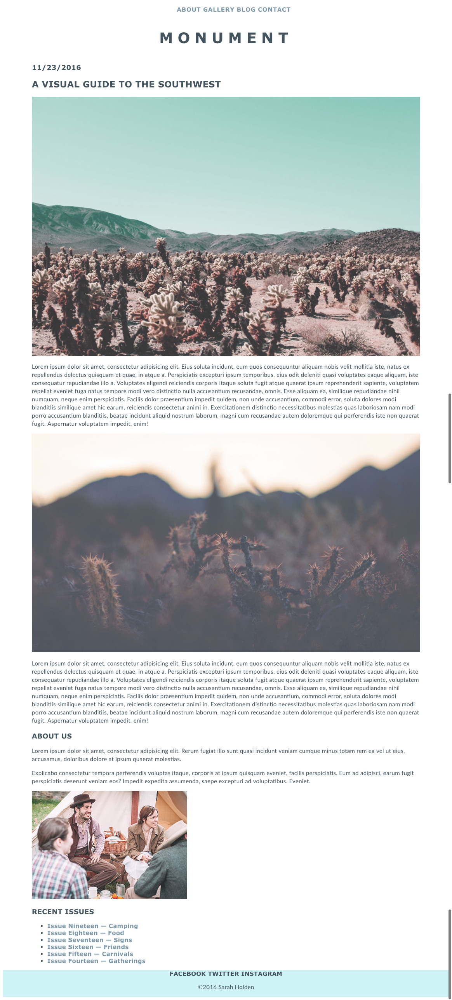
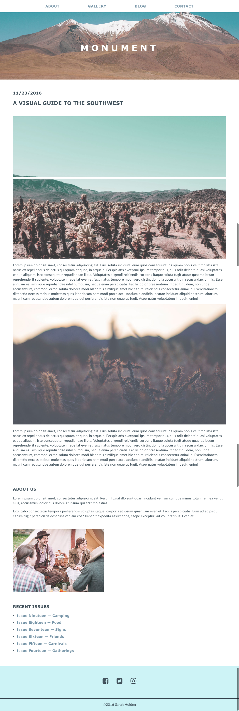

#  Monument Landing Page, Part 1

#### Overview

Congratulations! You have been hired as a developer for Monument Lifestyle Magazine. You work closely with a designer and have been provided design mockups of the magazine's website. Your goal is to replicate these mockups as closely as possible.

You will be adding components to the blog page for homework each night this week, then build the landing page for the site over the weekend.

---

#### Requirements

Your work must:

- Use a unique title and a single unique `h1` tag.
- Show images using `img` tags, including unique alt attributes.
- Use an external CSS stylesheet to style your pages.
- Include a properly structured HTML file with a head and body.
- Use HTML5 structural elements (nav, header, footer).
- Follow naming conventions, maintaining consistency across your `.html` and `.css` files.
- Indent nested elements to increase your code's readability.
- Use IDs, classes, and nested selectors to select and style elements on the page.
- Use [HTML](https://html5.validator.nu/) and [CSS](https://jigsaw.w3.org/css-validator/#validate_by_input) validators to check for errors before submitting.

**Bonus:**

- Google and implement a `background-image` for the header section. Look up properties such as `background-image`, `background-size`, and `background-position`.
- Google and implement FontAwesome Icons for the footer links to Facebook, Twitter, and Instagram.
- Experiment with padding and margin to add space between elements on the page.

#### Starter Code

Images that you'll need to recreate on the blog have been provided in the Starter Code folder in the pt-1 folder. This folder contains images you'll use today, as well as images you'll use when you build the landing page.

#### Suggested Ways to Get Started

- First, you'll want to create a `blog.html` file for the blog (you'll be using `index.html` for the landing page).
- Next, create a CSS file for the project (Be sure to use the `.css` file extension).
- Add a link to the CSS file in the head of your HTML file.
- Start by writing the HTML for the assignment, focusing on the _structure_ of the page (~20 minutes).
- Look at the design and start with the most general styles. For example, what color is most of the text? Does most of the text appear to use the same `font-family` (~10 minutes)?
- Then, begin adding more specific styles for elements (~15 min).

Be sure to pay attention to detail and consider the following:
- Did you consider the relationship of your h-tags' size to one another?
- Is the design of your h-tags consistent?
- Did you use a similar `font-family` to the design?
- Does your nav stand out against other links, but still feel consistent with the page design?
- Is anything *unstyled* or using its initial style on the page (blue, underlined links, Times New Roman font, etc.)?

#### Deliverable

##### Mockup:

##### Mockup with Bonus Tasks:

## [Next! Part 2!](../pt-2/README.md)
