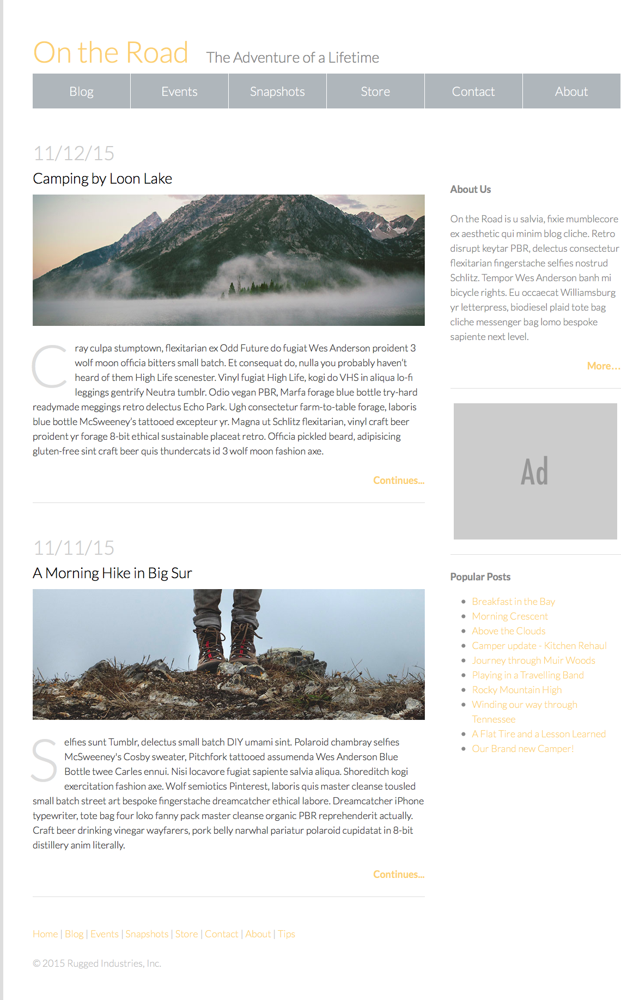

#  CSS Design Challenge Lab (90 mins)

## Learning Objectives
- Use flexbox to set up a grid system.

## Exercise
Pretend you've been hired as a junior developer to update a site with an old layout built with floats. The HTML can stay exactly the same, but the CSS must be changed to meet the requirements below. Be sure to reference the mockups in the 'Deliverables' section for guidance.

#### Requirements
- Change the layout from float to flex.
- Remove any unnecessary CSS without jeopardizing the layout.
- Add media queries to adjust the layout for smaller screens, per the images below.
- Fix any errors (formatting or otherwise) in the HTML and CSS.

#### Starter code
There are two sets of starter code provided: [one with errors](starter-code/with-errors) and [one without errors](starter-code/without-errors). If you're up for a debugging challenge, use the error-based starter code; if you want to focus on the differences between float and flex, choose the starter code without errors. You can always experiment with the error-based code if you finish early!

#### Deliverables
Here are the mockups you should reference while building your site. If you're using the code with errors, this will be a helpful reference for you! The design and layout of the site should not change once you've corrected all code errors and converted from float to flex.

