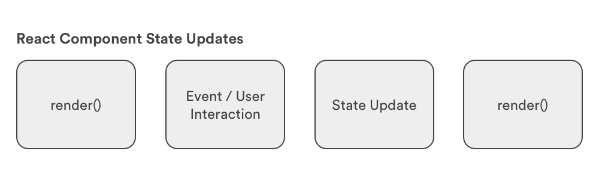
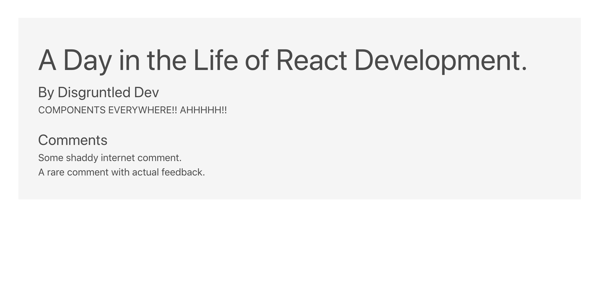
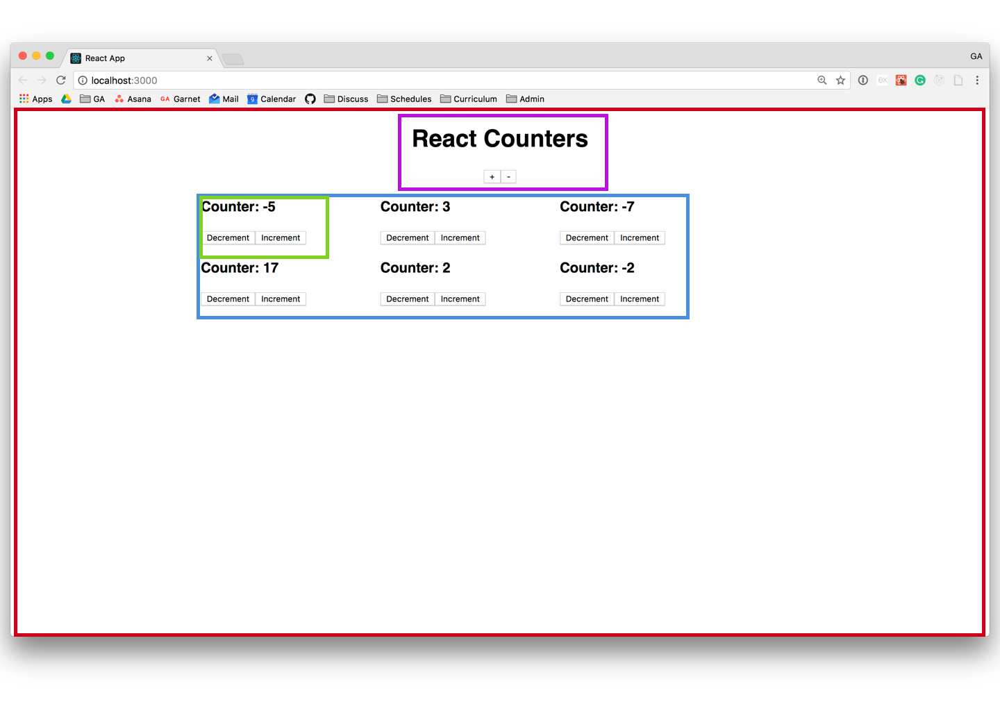

# State and Data-flow

## Learning Objectives

* Review passing data to a React component via `props`.
* Define and use nested components.
* Identify `state` in a React app.
* Modify the `state` of a React component through events.
* Distinguish container and presentational components.

## Framing

In this lesson we will be looking at how data is managed within a React application. In particular, we will compare and contrast a component's `props` and `state`. They are similar, but have a couple key distinctions:

* `props` are passed into a component, but `state` is local or native to the component
* While we cannot change `props` (immutable) from within a component, we can change a component's `state` (mutable).

First, let's revisit the fundamental unit of any React app: **components**.

## Components

Think back to F.I.R.S.T. principles of components. Components are:

* **Focused**,
* **Independent**,
* **Reusable**,
* **Small**, and
* **Testable**.

We design components to do as little as possible (*small*, *focused*) with a minimal amount of dependence on other components (*independence*, *reusable*).

## Props

While components should be independent, we still need them to talk to each other by passing data. However, to keep components small and focused, we pass only the data that is *specific to that component's purpose*. Data that is passed into one component by a parent component (or the application root), we refer to as `props`.

Let's take another look at our `Hello` component.

```jsx
// index.js
import React from 'react';
import ReactDOM from 'react-dom'
import Hello from './App.js'

ReactDOM.render(
  <Hello name={"Nick"} age={24} />,
  document.getElementById('root')
)
```

```jsx
// App.js
class Hello extends Component {
  render () {
    return (
      <div>
        <h1>Hello {this.props.name}</h1>
        <p>You are {this.props.age} years old</p>
      </div>
    )
  }
}
```

Props are one of the things that make React so powerful and help us make **independent** and **reusable** components. We can pass different data to our `Hello` component and easily get the same html and css but with different data:

```jsx
<Hello name={"Nick"} age={24} />
<Hello name={"Billy"} age={30} />
<Hello name={"Sheryl"} age={24} />
<Hello name={"Spencer"} age={15} />
```

Here we are passing values, `"Nick"` and `24` into our first `Hello` component in `index.js`, where we are **composing** `Hello` with the JSX expression, `<Hello name={"Nick"} age={24} />`. The `name` prop and `age` prop hold the values `"Nick"` and `24`, respectively. We cannot change the values of received `props` in a component - they are **immutable**. So what do we do with data we want to control from within a component?

## State

The limitation of props is that we can't change the data from within the component. The data that we can change within a component is called **[state](https://facebook.github.io/react/docs/state-and-lifecycle.html)**. We haven't talked about state much, but you have worked with it before. Just think about if you were to develop a game. Here are some examples:

* **Trivia**: what is the current score, what card is currently displayed to the user, is the user's input correct or incorrect?
* **Simon**: what order of buttons did the user push, what is the order of buttons they were supposed to push, what round or level are they on?
* **Tower of Hanoi**: how many discs are in each tower, how many moves has the user made?

We can figure out the `state` of a turn-based game because there is a clear idea of a beginning and end and states that reflect progress from one turn to the next turn: what flash card is the user on, what buttons do they need to push, how are the discs distributed among the three towers.


*Q: So we know an application can have different states. But how do we transition in between them?*

Events! (or user actions)


### F.I.R.S.T. Principles and State

The aim of the F.I.R.S.T. principles is to create a sane approach to breaking down not just a user-interface, but also an application's data so it is easy-to-manage chunks of data and the components that render them.

*Each component is concerned only with the data relevant to its purpose*.

For your first project, you had to do that manually. Manually write event listeners that would update state stored in global scope and then update your UI by manually updating individual DOM nodes.

You can think of React as an event-driven state machine, or a machine that churns out new states as a result of user interactions. A React application receives input through user interactions (event listeners) and outputs a UI that reflects a brand new state (new cards, fewer or more chips, etc).


 *Q: What do we mean by a React component's "state"?*

The object properties of a component (`this.state`) that change as the application runs, as opposed to `this.props`, which are immutable.


### State and Rendering

Before moving on to build our application, it's worth mentioning another aspect of component `state`: when it changes our components re-render:



Our UI gets updated when state changes. The user takes some action, like submitting information via a form, and the component holding that form has a `state` that is updated with the value of the user's input.

## Let's build something together.

Together we are going to grow our blog application with state and props! Yay!

```bash
git clone git@git.generalassemb.ly:sf-wdi-51/react-state-and-props.git
cd react-state-and-props/blog-app
npm install
npm start
```
You should be greeted with a Hello message. 

Now let's install a handy tool. [React Dev Tools](https://chrome.google.com/webstore/detail/react-developer-tools/fmkadmapgofadopljbjfkapdkoienihi?hl=en)

At the moment we will see our greeting component inside of google chrome's development tools under the React tab. (We can even see our props/state!)

Now let's create a new folder components and create 2 new components (Post and Comment) inside that folder.

Your structure should look like this:

```
blog-app
├──  favicon.ico
├──  public
├──  node_modules
├──  package.json
└──  src
    ├──  components
          └──  Comment.js
          └──  Post.js
    ├──  App.css
    ├──  App.js
    ├──  index.css
    ├──  index.js
    └──  logo.svg

```

Let's throw some info into those files! 

**Post.js**
```js
import React, { Component } from 'react';
// Load in Comment component
import Comment from './Comment.js'

class Post extends Component {
    render() {
      let comments = this.props.comments.map((comment, index) => (
        <Comment message={comment} key={index}/>
      ))
      return(
        <div className='post-page'>
          <h1>{this.props.title}</h1>
          <h2>By {this.props.author}</h2>
          <p>{this.props.body}</p>
          <h3>Comments</h3>
          {comments}
        </div>
      )
    }
  }

export default Post;
```

Let's break down the above code. We created a Post component that takes in the props: title, author, body, and an array of comments. For each comment inside of *this.props.comments* it will create a Comment component. Since this file requires the Comment component let's update that next. 

```js
import React, {Component} from 'react'

class Comment extends Component {
  render () {
    return (
      <div>
        <p>{this.props.message}</p>
      </div>
    )
  }
}

export default Comment
```
Awesome! Now to update our index.js to render out the Post Component.

```js
import React from 'react'
import ReactDOM from 'react-dom'
import Post from './components/Post'
import './App.css'

ReactDOM.render(
  <Post className='post' title={'A Day in the Life of React Development.'} author={'Disgruntled Dev'} body={'COMPONENTS EVERYWHERE!! AHHHHH!!'} comments={['Some shaddy internet comment.','A rare comment with actual feedback.']}/>,
  document.getElementById('root')
)
```

As you can see we are rendering a Post component with the props that we defined earlier.

You should see this now: 



So far we have dealt with only props to pass information from one component to another. But, what if we wanted data to change within a component? Time for State! 

As an example we will be adding "Karma" to our comments. (This will make sense in a moment I promise.)

Let's set state inside of our comments. 

```js
import React, {Component} from 'react'

class Comment extends Component {
  state = {
    karma: 'good'
  };

  render () {
    return (
      <div className={this.state.karma}>
        <p>{this.props.message}</p>
      </div>
    )
  }
}

export default Comment
```
Inside our dev tools we will now see that by default we have set the state of karma to 'good' for all comments. We also used this state to declare a classname attached to our comment component. Now that we have a set state we can now create a method built into our component to update the state.

We will be creating a ChangeKarma method to update our state and a button that will call the method. Simply the function checks the state and toggles it depending on what it is.

```js
import React, {Component} from 'react'

class Comment extends Component {
  state = {
    karma: 'good'
  };

  changeKarma(){
    if (this.state.karma === 'good'){
      this.setState({
        karma: 'bad'
      })
    } else {
      this.setState({
        karma: 'good'
      })
    }
  }

  render () {
    return (
      <div className={this.state.karma}>
        <p>{this.props.message}</p>
        <button className={"button"} onClick={this.changeKarma}>Change Karma</button>
      </div>
    )
  }
}

export default Comment
```

So onClick the button will run the method changeKarma. BUT WAIT! It errors! Because of the fact that this method is created inside of a constructor we have to bind it to the component so *this* keyword will work correctly. 

```js
  state = {
    karma: 'good'
  };
  changeKarma = this.changeKarma.bind(this);
```
Amazing!  Now when we click on our button the class attached to the component is switched without having to refresh the page. 

**What other type of states can we add?**

## Check for Understanding

* What is the difference between `state` and `props`?
* What do we use `props` for?
* What do we use `state` for?

We've done a fair amount of framing so far, so let's dive in to building another application!

## Exercise: React Counters

For this exercise, we are going to build a React app from scratch that will serve as an [Abacus](https://en.wikipedia.org/wiki/Abacus) of sorts.

Go ahead and clone [React Counters](https://git.generalassemb.ly/ga-wdi-exercises/react-counters) now. This will be the code we start with.

```bash
$ git clone https://git.generalassemb.ly/ga-wdi-exercises/react-counters
$ cd react-counters
$ npm install
$ npm start
```

## Start with a Mock

The first step in creating a React app is to start with a [mock](https://facebook.github.io/react/docs/thinking-in-react.html#start-with-a-mock) and some sample data.

### You Do: Identify Components 


Look at this [deployed version of the application](http://react-counter.surge.sh/) and answer the following questions:

- How many components does this application have?
- What components is this application built of?

### Components

<details>
  <summary><strong>Open to see the components</strong></summary>

  

Here we've identified four components on the home page:
  1. The top level component, which we'll call `App`, is boxed in red
  2. The header component, a sub-component of `App`, is boxed in purple. We'll call it `Header`
  3. The list of counters, also a sub-component of `App`, is boxed in blue. We'll called it `ContainerList`
  4. An individual container, a sub-component of `ContainerList`, is boxed in green. We'll call it `Counter`

</details>

<details>
  <summary><strong>Open to see component hierarchy</strong></summary>

  <h4>Component Hierarchy</h4>

Given these breakdowns we have a component hierarchy that looks like this:

  - `App`
    - `Header`
    - `CounterList`
      - `Counter`

</details>

### Sample Data

In the final application, we'll be able to use the two buttons in the header to increase and decrease the number of individual counters on the page. However, to start, we're going to feed the number of counters into the application as hard-coded data.

The below Javascript will go in our `index.js` file and will later be passed into our `App` component as props:

```js
const data = {
  counters: 5
}
```

## Building a Static Version of the App


First we will [build a static version](https://facebook.github.io/react/docs/thinking-in-react.html#step-2-build-a-static-version-in-react) of the app passing all of our data by `props`. This makes it much easier to avoid getting bogged down in tricky details of functionality while implementing the visual appearance of the UI.

### You Do: Set Up the `App` Component and `index.js`


Try to get it so that your `App` component displays the number of counters underneath the `Header` component (provided in the starter code).

<details>
	<summary>Solution</summary>
	
`index.js`:

```js
import React from "react";
import ReactDOM from "react-dom";
import "./index.css";
import App from "./App";

const data = {
  counters: 5
};

ReactDOM.render(<App data={data} />, document.getElementById("root"));
```
	
`App.js`:

```js
import React, { Component } from "react";
import Header from "./Header";

class App extends Component {
  render() {
    return (
      <div className="App">
        <Header />
        <h4>{this.props.data.counters}</h4>
      </div>
    );
  }
}

export default App;
```
</details>

### You Do: Set Up the `CounterList` and `Counter` Components


Your `CounterList` component should take the number of counters as a prop and then render that many versions of your `Counter` component. Your `Counter` component will render `"Counter: 0"` inside of an `<h4>` and two buttons (one for incrementing and one for decrementing).

**Tip:** You can render an array of components! It looks something like this:

```js
class List extends Component {
  render() {
    let list = [<Item />, <Item />, <Item />];

    return <div className="list">{list}</div>;
  }
}
```

<details>
	<summary>Solution</summary>
	
`CounterList.js`:

```js
import React, { Component } from "react";
import Counter from "./Counter";

class ContainerList extends Component {
  render() {
    let counters = [];
    for (let index = 0; index < this.props.counter; index++) {
      counters.push(<Counter />);
    }
    return <div className="Counter-row">{counters}</div>;
  }
}

export default ContainerList;
```

`Counter.js`:

```js
import React, { Component } from "react";

class Counter extends Component {
  render() {
    return (
      <div className="Counter">
        <h4>Counter :0</h4>
        <button>Decrement</button>
        <button>Increment</button>
      </div>
    );
  }
}

export default Counter;
```

</details>


## Identify the Minimal Representation of UI State 

At the moment all of our data is being passed through our app as props. We know, however, that we will have data that changes as a user interacts with the app. That information needs to live in our application's state. We need to figure out what the [minimal amount of state](https://facebook.github.io/react/docs/thinking-in-react.html#step-3-identify-the-minimal-but-complete-representation-of-ui-state) our app needs and what components need it.

### You Do: What information needs to live in state? 

This may include a value(s) that we have not yet included in our code.

<details>
  <summary>Solution</summary>

For our app to work we need:

- `numberOfCounters` (the number of counters to render in our `App` component)
- `count` (the count of a `Counter` component)
</details>

## Identify Where Your State Should Live 

Central to [deciding where state lives](https://facebook.github.io/react/docs/thinking-in-react.html#step-4-identify-where-your-state-should-live) is the idea of **one way data flow**. The React documentation describes this step as "often the most challenging part for newcomers to understand" since we are learning to distinguish state from props.   

Our task here is to find the proper place for each part of our application's state.

## Working with State 

Lets start with our `Counter` component. Right now, it doesn't have any state and it isn't passed any props. What we want is for the `Counter` component to keep track of the count in state. Then, whenever someone clicks one of the two buttons we'll increase or decrease that number.

### We Do: Update our `Counter` Component

Lets update the `Counter` component so that it is using state to track the count internally and clicking one of the buttons changes the `count` number.

<details>
	<summary>Solution</summary>
	
```diff
import React, { Component } from "react";

class Counter extends Component {
+  constructor() {
+    super();
+
+    this.state = {
+      count: 0
+    };
+
+  }

  render() {
    return (
      <div className="Counter">
        <h4>Counter: {this.state.count}</h4>
-        <button>Decrement</button>
+        <button onClick={this.increaseCount}>Decrement</button>
-        <button>Increment</button>
+        <button onClick={this.decreaseCount}>Increment</button>
      </div>
    );
  }

+  increaseCount = () => {
+    let count = this.state.count + 1;
+
+    this.setState({
+      count
+    });
+  }
+
+  decreaseCount = () => {
+    let count = this.state.count - 1;
+
+    this.setState({
+      count
+    });
  }
}

export default Counter;
```
</details>

Now that we've made it so our `Counter` component is tracking it's count inside of state, we need to update our application so that the prop determining the number of counters is controlled by state.

This segues nicely into the idea of Container and Presentational Components.

## Container & Presentational Components 

The above workflow has led to the popular component architecture of distinguishing [Container and Presentational Components](https://medium.com/@dan_abramov/smart-and-dumb-components-7ca2f9a7c7d0).

**Presentational components** are components that render themselves based solely on the information that they receive from props. At this point, all of our components are presentational.

**Container components** are components whose job it is to exclusively manage state and and render presentational components, passing them the data they need as props.

This leads to a very nice division where state management and presentation are cleanly separated.

Our `App` component could be a **container component!**

### You Do: Update `App`


We want to update `App` so that it is tracking the number of counters to render in it's `state`. To do that, we need to update our component.

Make it so that the `App` component is tracking the number of counters (5) inside state and passing that as a prop to the `CounterList` component.

<details>
	<summary>Solution</summary>
	
```diff
// App.js
import React, { Component } from "react";
import Header from "./Header";
import CounterList from "./CounterList";

class App extends Component {
+  constructor() {
+    super();
+
+    this.state = {
+      counters: 5
+    };
+  }
  render() {
    return (
      <div className="App">
        <Header />
-        <CounterList counter={this.props.data.counters} />
+        <CounterList counter={this.state.counters} />
      </div>
    );
  }
}

export default App;
```
</details>

Our `CounterList` component is now rendering the number of counters in the state of our `App` component, but we don't have a way to update our state!

Just like in your first project, we're going to update the state of our application in response to events. In this particular case, we'll update state (the number of counters to render) when someone clicks one of the two buttons in the header.

There's just one issue: those two buttons are in our `Header` component (a presentational component).

## Add Inverse Data Flow 

We can give presentational components behavior by passing callback functions to them as props. By binding those callback functions to the parent, container component we can use them to update our state. In React, we refer to this as [inverse data flow](https://facebook.github.io/react/docs/thinking-in-react.html#step-5-add-inverse-data-flow). We will need two functions defined in `App` and passed to `Header`.

### You Do: Increase and Decrease the Number of Counters

Define an `increaseCounters()` method and `decreaseCounters()` method on the `App` component (they'll be a lot like the `increaseCount()` and decreaseCount()` methods of our `Counter` component).

Once your two methods are defined, pass them both to the `Header` component as props. What do you need to do inside of `Header` to make it so that when someone clicks on one of the buttons the number of counters increases or decreases?

## Closing 

If asked, could you explain the differences between props and state? We've now covered the differences between the two as well as how you can use state to control data inside a component and how to update state to display new data to a user.

Defining components and working with props and state (data) constitutes the majority of the work of building a React application.

## Bonus

### Style in React

When it comes to adding styles to React, there is a bit of debate over what's the best practice. Facebook's official docs and recommendations are to write stylesheets that treat your CSS rule declarations as properties on one big Javascript object that can be passed into components via inline styles.

From the [Docs](https://facebook.github.io/react/tips/inline-styles.html)...

>  "In React, inline styles are not specified as a string. Instead they are specified with an object whose key is the camelCased version of the style name, and whose value is the style's value, usually a string"

However, this kind of rethinking the wheel feels like a step backwards for a lot of designers and developers who cringe at the notion of inline styles. For them, they choose to build React apps through a more traditional flow of adding ids and classes and then targeting elements via external stylesheets.

Also, via Webpack and other custom loaders, it is possible to use many third-party libraries or processors such as SASS, LESS, and Post-CSS.

Interesting to note, this problem has not been universally solved, and thus the debate will most likely continue to rage on until somebody figures it out. Therefore, its often left to a team decision when choosing the best option for the application.

Interested in learning more? Check out some excellent blog posts on the subject from the front-end community:
- https://medium.com/@jviereck/modularise-css-the-react-way-1e817b317b04#.61qgjgdu3
- http://jamesknelson.com/why-you-shouldnt-style-with-javascript/
- http://stackoverflow.com/questions/26882177/react-js-inline-style-best-practices
- https://css-tricks.com/the-debate-around-do-we-even-need-css-anymore/

### [Example of Object Literal Styles with React](https://github.com/ga-wdi-exercises/react-omdb/commit/830697fc68dcdccafcae9f73e711103de8d93fc9)

> **Reminder**: `class` is a protected keyword in React, in order to add a class attribute to an element use the keyword `className`

To add the finishing touches to our application, let's take a stab at styling our app with inline-styles and advance our markup with some help from Bootstrap...
- Load in Bootstrap CDN in `index.html`
- Modify UI to include Bootstrap classes
- Create a `styles` directory and make a file for your CSS rule definitions - this will be written in Javascript!
- Load in that file in any component and then use that to apply inline styling

### Resources

* [Imperative vs. Declarative Javascript](http://www.tysoncadenhead.com/blog/the-state-of-javascript-a-shift-from-imperative-to-declarative#.VxgGxZMrKfQ)
* [Styling in React](http://survivejs.com/webpack_react/styling_react/)
* [ReactJS Fundamentals Course](http://courses.reactjsprogram.com/courses/reactjsfundamentals)
