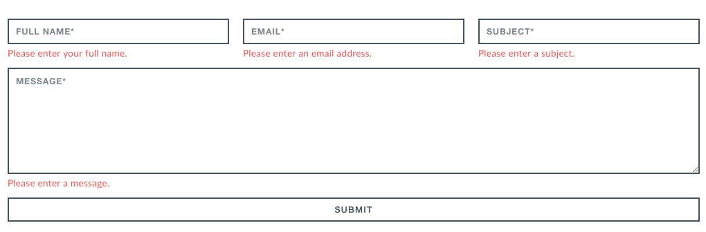
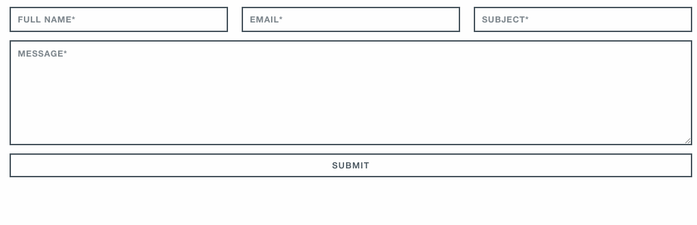
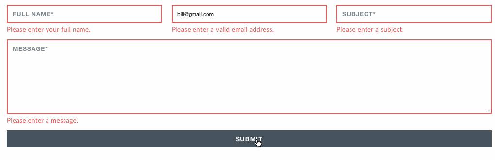

#  Monument Landing Page

## Exercise
In this homework assignment, you will add some basic front-end validation to the contact form that you built in week 1 for the Monument Landing Page.

#### Requirements
- Create a `js` folder, and a `main.js` file inside that folder.
- In the `index.html` file, use `<script>` tags to include jQuery and your `main.js` file.
- Create a class `error` in your CSS. You will later apply this class using jQuery if a field is blank. The class should give an input/textarea the following border: `border: 2px solid #ED5254`.
- Style the error messages in your CSS file. Refer to the screenshot below to see what those error messages should look like. Once you've styled the error messages, use `display: none;` to hide them from the page by default. You will later fade them in using jQuery if a field is blank.
- When the user _submits_ the contact form:
	- Prevent the default form action so that the page will not reload.
		- Hint: Use `preventDefault()` here.
	- Loop through the input/textarea fields inside the contact form.
	- If a field is blank, add the error class to that field and fade in the error message related to that field.
		- Hint #1: Within the loop, you can use the `this` keyword to find out what the current field is.
		- Hint #2: When trying to fade in the related error message, jQuery's `siblings()` method may be useful.
		- Hint #3: Lost on how to check to see if an input/textarea is empty? Google "Check if input is empty jQuery."
	- It is possible that the user has already submitted the form with errors and has now corrected those errors. If an input field is _not_ empty, remove the error class and hide the related error message.
	- Submit 2-5 questions that you would like addressed regarding this homework.

#### Hints
- Be sure to use `$(document).ready`... in your `main.js` to make sure the HTML content is loaded before your JavaScript is executed.

#### Starter code (if needed)

HTML/CSS for the form has been provided in the starter code.

#### Deliverable

Styles for error messages:

What the form should look like if no fields are completed and the form is submitted:

What the form should look like if the user previously had a blank field, adds text to that field, and then hits enter again:

## Hungry For More?:
- When the user submits the form, if the email field is not blank, check to make sure that the user has entered a valid format for their email address. 
	- If the user has not entered a valid email address, add the `error` class to the email input field and change the error message to say: "Please enter a valid email address."
	- Hint: Look up "Validate Email Regex jQuery." It may be helpful to research regex (regular expressions) in general.
- If you've completed the above tasks, update the navigation so that whenever a user clicks on a nav item, the scroll to the related section is animated. 
	- Hint: Look up "Smooth scroll jQuery".

#### Bonus Deliverables

What the form should look like if the user submits the form with input that is not a valid email address format:

What the form should look like if the user corrects the invalid email address:

What the smooth scroll should look like:

